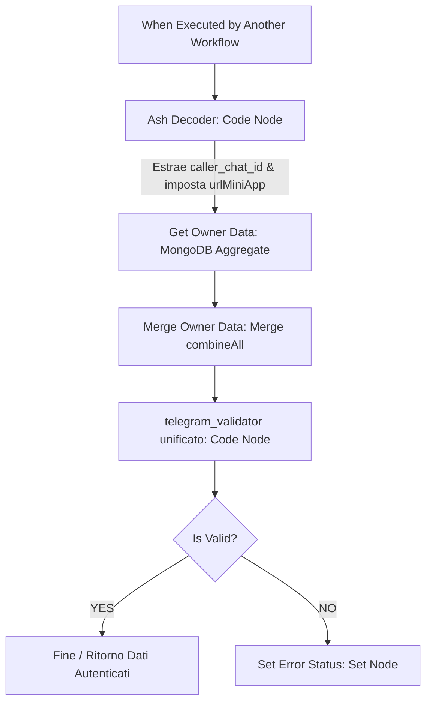
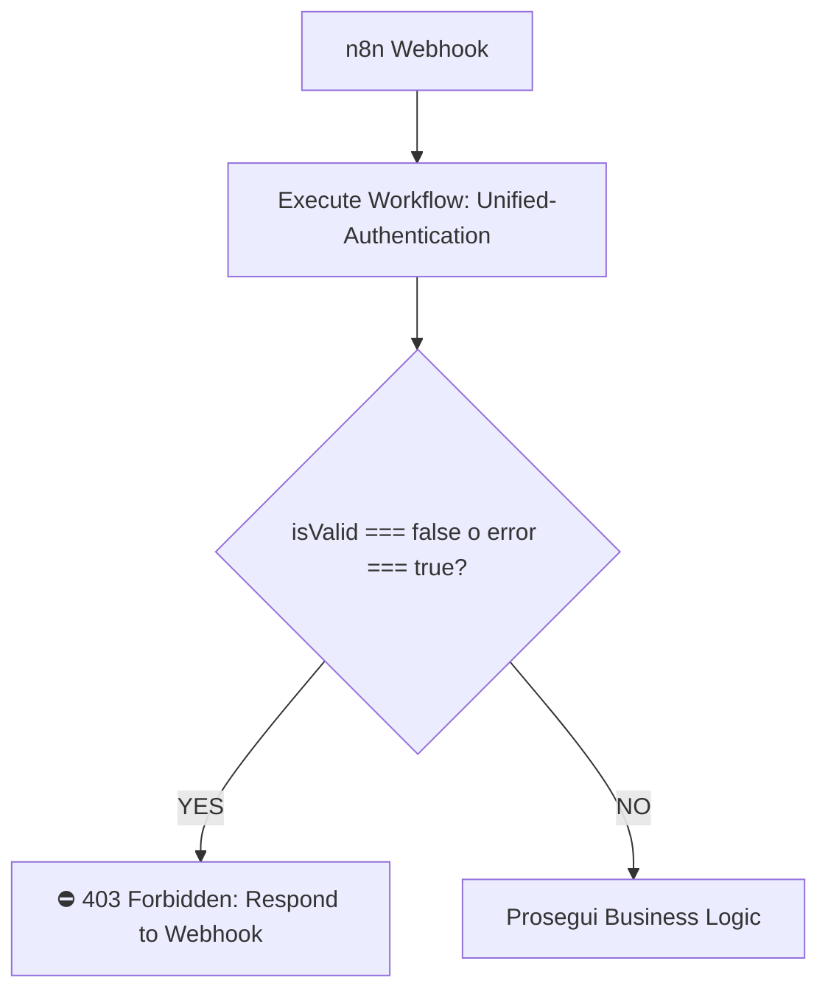
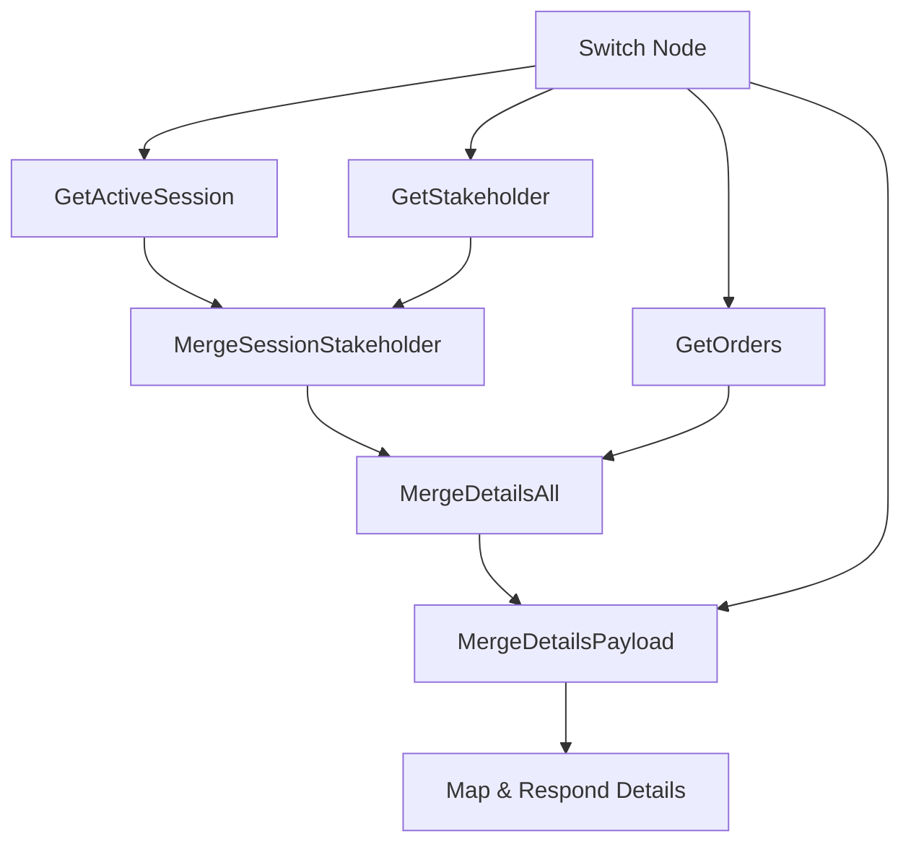
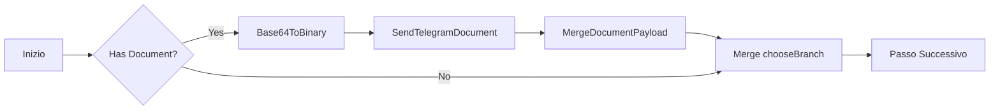
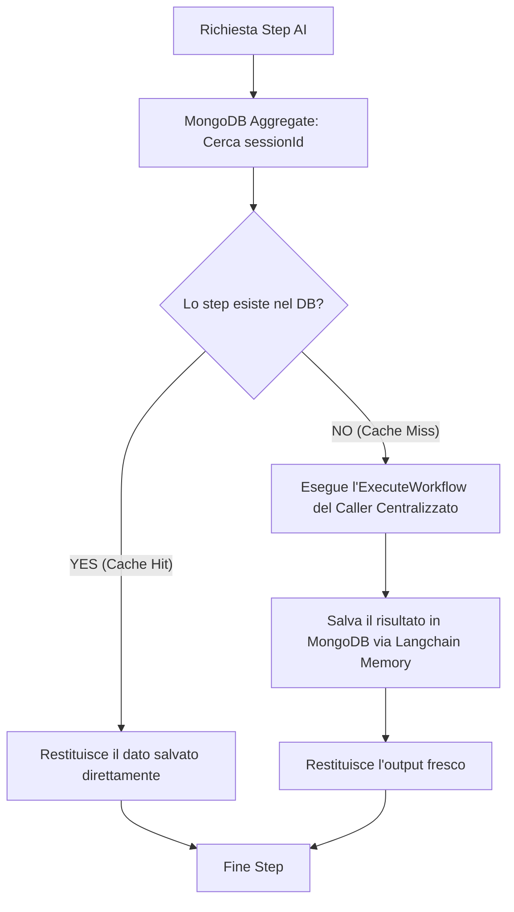
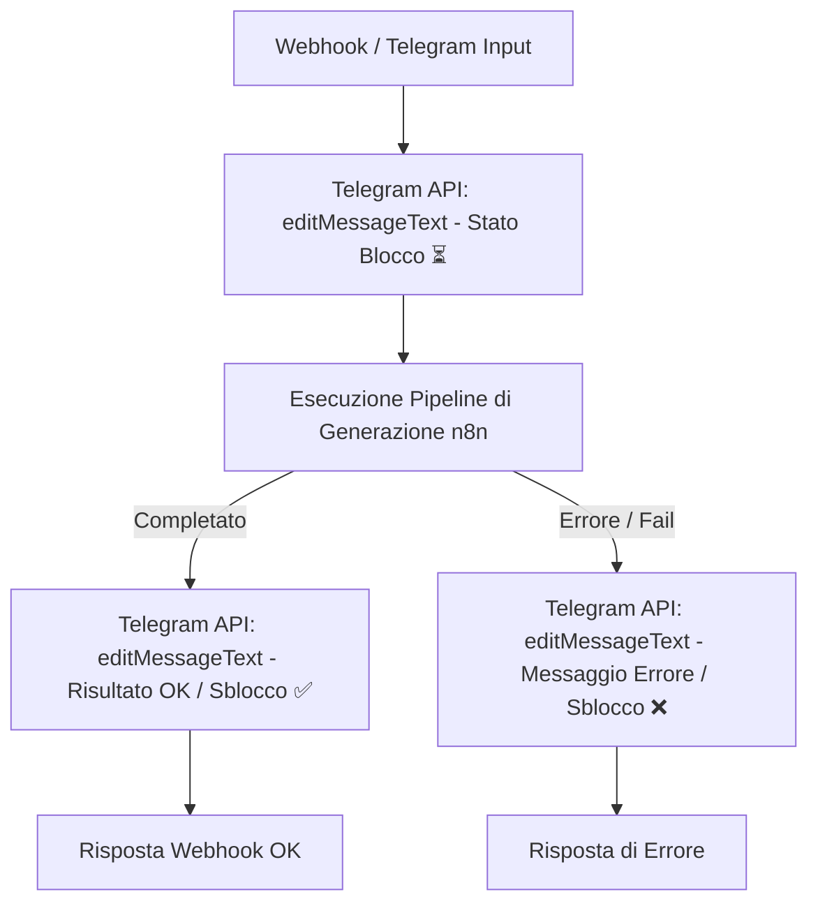
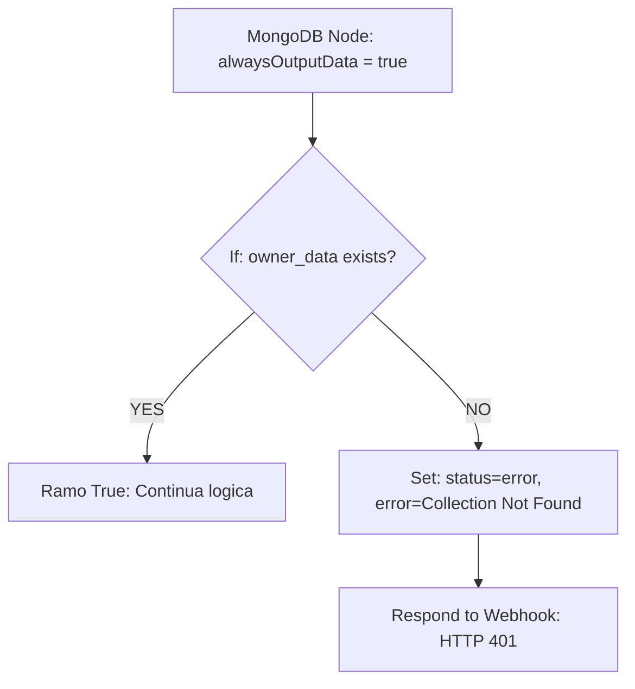

# Standard di Sviluppo Workflow n8n (SiteBoS Project)

Questo documento definisce le specifiche tecniche, gli standard di sicurezza, i pattern di programmazione e le convenzioni grafiche per lo sviluppo dei workflow n8n all'interno della directory [n8n_workflows](file:///c:/Users/garof/Desktop/TrinAi/SiteBoS-MiniApp/n8n_workflows).

---

### 1. Sicurezza e Validazione Unificata (Security First - Subworkflow Pattern)

L'autenticazione è implementata centralmente come un **Subworkflow** riutilizzabile ([Unified-Authentication.json](file:///c:/Users/garof/Desktop/TrinAi/SiteBoS-MiniApp/n8n_workflows/Unified-Authentication.json)). Ogni webhook esposto pubblicamente deve delegare la validazione a questo subworkflow e propagare gli eventuali errori di sicurezza tramite una risposta 403 Forbidden.

### Struttura del Subworkflow di Autenticazione:



Nei workflow genitori (quelli che contengono il Webhook pubblico), la validazione viene integrata nel seguente modo:



---

### A. Decodifica Token di Transazione (`Ash Decoder`)
Un nodo **Code** JavaScript all'inizio del subworkflow che decodifica e verifica la firma simmetrica dell'ASH token, estrae il `caller_chat_id` e determina l'ambiente dell'applicazione (`urlMiniApp`).
- **Chiave di Firma**: `TrinAI-Autorize-Transaction-2=2&`
- **Varianti ASH Supportate**:
  - **Owner (3 parametri)**: `[chatId, timestamp, webhookId]` $\rightarrow$ `caller_chat_id` = `parts[0]`.
  - **Operator/Customer (4 parametri)**: `[owner_id, secondary_id, timestamp, webhook]` $\rightarrow$ `caller_chat_id` = `parts[1]`.
- **Nomenclatura**: Il nodo si chiama **`Ash Decoder`** e popola nell'oggetto JSON i dati decodificati (`ids`, `urlMiniApp`, `ash_role`):
  ```json
  "ids": {
    "owner_id": "parts[0]",
    "secondary_id": "parts[1] (se presente)",
    "operator": "parts[1] (se presente)",
    "customer_id": "parts[1] (se presente)",
    "caller_chat_id": "parts[0] o parts[1]",
    "timestamp": "parts[2]",
    "webhook": "parts[3]"
  },
  "urlMiniApp": "https://..."
  ```

#### Codice Standard per `Ash Decoder` (Copia/Incolla):
```javascript
const item = $input.first().json;
const SECRET_KEY = 'TrinAI-Autorize-Transaction-2=2&';

const rawAsh =
  item.ash ||
  item.query?.ash ||
  item.body?.ash ||
  item.body?.web_app_data?.data ||
  item.body?.message?.web_app_data?.data;

if (!rawAsh || typeof rawAsh !== "string") {
  throw new Error("ASH non trovato nell'input.");
}

const [encodedPayload, signatureReceived] = rawAsh.split(".");
if (!encodedPayload || !signatureReceived) {
  throw new Error("Formato ASH non valido.");
}

let decodedPayload;
try {
    decodedPayload = Buffer.from(encodedPayload, "base64").toString("utf8");
} catch (e) {
    throw new Error("Errore decodifica Base64.");
}

function verifySignature(payload, secret, receivedSig) {
    let hash = 0;
    const combined = payload + secret;
    for (let i = 0; i < combined.length; i++) {
        hash = ((hash << 5) - hash) + combined.charCodeAt(i);
        hash = hash & hash; 
    }
    const expectedSig = Math.abs(hash).toString(16);
    return expectedSig === receivedSig;
}

if (!verifySignature(decodedPayload, SECRET_KEY, signatureReceived)) {
    throw new Error("SECURITY: Firma ASH non valida o manomessa. Accesso negato.");
}

const parts = decodedPayload.split("|");
let ids = {};
let role = "";

if (parts.length === 3) {
    // Formato Owner: [chatId, timestamp, webhookId]
    ids = {
        owner_id: parts[0],
        caller_chat_id: parts[0],
        timestamp: parts[1],
        webhook: parts[2]
    };
    role = "owner";
} else if (parts.length === 4) {
    // Formato Operator o Customer: [owner_id, secondary_id, timestamp, webhook]
    ids = {
        owner_id: parts[0],
        secondary_id: parts[1],
        operator: parts[1],
        customer_id: parts[1],
        caller_chat_id: parts[1],
        timestamp: parts[2],
        webhook: parts[3]
    };
    role = "secondary";
} else {
    throw new Error("Struttura interna ASH non supportata.");
}

const testers = ["2041408875", "8305126267"];
const urlMiniApp = testers.includes(String(ids.caller_chat_id))
  ? "https://trinaibusinessoperatingsystem.github.io/SiteBoS-MiniApp/telegram_control/"
  : "https://telegram.trinai.it/";

return [{ 
    json: {
        ...item,
        ash_valid: true,
        ash_role: role,
        ids: ids,
        urlMiniApp: urlMiniApp
    }
}];
```

---

### C. Get Owner Data & Merging (MongoDB Query)
Subito dopo `Ash Decoder`, interroga MongoDB per caricare la sessione dell'owner corrispondente a `ids.owner_id` (vedi **Sezione 7** per il nodo aggregate standard).
Il risultato deve essere unito tramite un nodo **Merge** (`combineAll`) per conservare il payload originario (`_auth`, `body` del webhook).

---

### D. Validazione Crittografica Telegram WebApp (`telegram_validator`)
Un nodo **Code** JavaScript che decodifica la query string `body._auth` ed esegue la validazione HMAC-SHA256 testando dinamicamente i **3 bot token candidati**:
1. **Owner Custom Bot**: `owner_data.bot_key` (se presente).
2. **Operator Global Bot**: `8644939941:AAHPiZM3D9xg6TbHXGSiCfiXbA4q99fyuYQ`.
3. **Customer Global Bot**: `8378810625:AAHK3Zya8qFKD4OzFBbwSTOAGolDeY7jiJQ`.

#### Codice Standard per `telegram_validator` (Copia/Incolla):
```javascript
// --- 1. CONFIGURAZIONE ---
const item = $input.first().json;
const initData = item.body?._auth || item.query?._auth || item._auth;

if (!initData) {
    return [{ json: { isValid: false, error: "Dato _auth di Telegram mancante." } }];
}

// Generiamo la lista dei token candidati
const candidateTokens = [];
if (item.owner_data?.bot_key) {
    candidateTokens.push({ token: item.owner_data.bot_key, source: "owner_custom" });
}
candidateTokens.push({ token: "8644939941:AAHPiZM3D9xg6TbHXGSiCfiXbA4q99fyuYQ", source: "operator_global" });
candidateTokens.push({ token: "8378810625:AAHK3Zya8qFKD4OzFBbwSTOAGolDeY7jiJQ", source: "customer_global" });

// --- 2. LIBRERIA CRIPTOGRAFICA PURE JS (SHA-256 & HMAC) ---
const CryptoJS = (function() {
    function sha256(m) {
        var h = [0x6a09e667, 0xbb67ae85, 0x3c6ef372, 0xa54ff53a, 0x510e527f, 0x9b05688c, 0x1f83d9ab, 0x5be0cd19];
        var k = [0x428a2f98, 0x71374491, 0xb5c0fbcf, 0xe9b5dba5, 0x3956c25b, 0x59f111f1, 0x923f82a4, 0xab1c5ed5, 0xd807aa98, 0x12835b01, 0x243185be, 0x550c7dc3, 0x72be5d74, 0x80deb1fe, 0x9bdc06a7, 0xc19bf174, 0xe49b69c1, 0xefbe4786, 0x0fc19dc6, 0x240ca1cc, 0x2de92c6f, 0x4a7484aa, 0x5cb0a9dc, 0x76f988da, 0x983e5152, 0xa831c66d, 0xb00327c8, 0xbf597fc7, 0xc6e00bf3, 0xd5a79147, 0x06ca6351, 0x14292967, 0x27b70a85, 0x2e1b2138, 0x4d2c6dfc, 0x53380d13, 0x650a7354, 0x766a0abb, 0x81c2c92e, 0x92722c85, 0xa2bfe8a1, 0xa81a664b, 0xc24b8b70, 0xc76c51a3, 0xd192e819, 0xd6990624, 0xf40e3585, 0x106aa070, 0x19a4c116, 0x1e376c08, 0x2748774c, 0x34b0bcb5, 0x391c0cb3, 0x4ed8aa4a, 0x5b9cca4f, 0x682e6ff3, 0x748f82ee, 0x78a5636f, 0x84c87814, 0x8cc70208, 0x90befffa, 0xa4506ceb, 0xbef9a3f7, 0xc67178f2];
        var b = Array.from(typeof m === 'string' ? new TextEncoder().encode(m) : m);
        var l = b.length * 8; b.push(0x80);
        while ((b.length * 8) % 512 !== 448) b.push(0);
        for (let i = 7; i >= 0; i--) b.push((l / Math.pow(2, i * 8)) & 0xff);
        for (let i = 0; i < b.length; i += 64) {
            var w = new Int32Array(64);
            for (let j = 0; j < 16; j++) w[j] = (b[i + j * 4] << 24) | (b[i + j * 4 + 1] << 16) | (b[i + j * 4 + 2] << 8) | (b[i + j * 4 + 3]);
            for (let j = 16; j < 64; j++) {
                var s0 = ((w[j - 15] >>> 7) | (w[j - 15] << 25)) ^ ((w[j - 15] >>> 18) | (w[j - 15] << 14)) ^ (w[j - 15] >>> 3);
                var s1 = ((w[j - 2] >>> 17) | (w[j - 2] << 15)) ^ ((w[j - 2] >>> 19) | (w[j - 2] << 13)) ^ (w[j - 2] >>> 10);
                w[j] = (w[j - 16] + s0 + w[j - 7] + s1) | 0;
            }
            var v = [...h];
            for (let j = 0; j < 64; j++) {
                var S1 = ((v[4] >>> 6) | (v[4] << 26)) ^ ((v[4] >>> 11) | (v[4] << 21)) ^ ((v[4] >>> 25) | (v[4] << 7));
                var ch = (v[4] & v[5]) ^ (~v[4] & v[6]);
                var t1 = (v[7] + S1 + ch + k[j] + w[j]) | 0;
                var S0 = ((v[0] >>> 2) | (v[0] << 30)) ^ ((v[0] >>> 13) | (v[0] << 19)) ^ ((v[0] >>> 22) | (v[0] << 10));
                var maj = (v[0] & v[1]) ^ (v[0] & v[2]) ^ (v[1] & v[2]);
                var t2 = (S0 + maj) | 0;
                v.unshift((t1 + t2) | 0); v.splice(8); v[4] = (v[4] + t1) | 0;
            }
            for (let j = 0; j < 8; j++) h[j] = (h[j] + v[j]) | 0;
        }
        return h.reduce((acc, val) => acc.concat([(val >>> 24) & 0xff, (val >>> 16) & 0xff, (val >>> 8) & 0xff, val & 0xff]), []);
    }
    if (typeof TextEncoder === "undefined") {
        window.TextEncoder = function() {};
        TextEncoder.prototype.encode = function(s) {
            return new Uint8Array(unescape(encodeURIComponent(s)).split("").map(c => c.charCodeAt(0)));
        };
    }
    return {
        hmac: function(key, message) {
            var k = typeof key === 'string' ? Array.from(new TextEncoder().encode(key)) : key;
            var m = Array.from(new TextEncoder().encode(message));
            var b = 64;
            if (k.length > b) k = sha256(k);
            while (k.length < b) k.push(0);
            var ipad = k.map(x => x ^ 0x36);
            var opad = k.map(x => x ^ 0x5c);
            var inner = sha256(ipad.concat(m));
            return sha256(opad.concat(inner));
        }
    };
})();

// --- 3. LOGICA PARSING ---
const data = {};
initData.split('&').forEach(pair => {
    const [k, v] = pair.split('=');
    data[k] = decodeURIComponent(v);
});

const hashReceived = data.hash;
const checkString = Object.keys(data)
    .filter(k => k !== 'hash')
    .sort()
    .map(k => k + '=' + data[k])
    .join('\\n');

// --- 4. CONTROLLO SCADENZA (MAX 1 ORA) ---
const now = Math.floor(Date.now() / 1000);
const authDate = parseInt(data.auth_date);
const isExpired = (now - authDate) > 3600;

// --- 5. TENTATIVI DI CALCOLO HASH TELEGRAM ---
let isValid = false;
let matchedSource = null;
let matchedToken = null;

if (!isExpired) {
    for (const itemToken of candidateTokens) {
        const secretKey = CryptoJS.hmac("WebAppData", itemToken.token);
        const computedHashBytes = CryptoJS.hmac(secretKey, checkString);
        const computedHash = computedHashBytes.map(b => b.toString(16).padStart(2, '0')).join('');
        
        if (computedHash === hashReceived) {
            isValid = true;
            matchedSource = itemToken.source;
            matchedToken = itemToken.token;
            break;
        }
    }
}

return [{
    json: {
        ...item,
        isValid: isValid,
        isExpired: isExpired,
        auth_source: matchedSource,
        matched_token: matchedToken,
        user: data.user ? JSON.parse(data.user) : null,
        auth_date_human: new Date(authDate * 1000).toLocaleString('it-IT')
    }
}];
```

- **Uscita TRUE (Is Valid?)**: Reindirizza al nodo **`appUrl`**.
- **Uscita FALSE (Is Valid?)**: Reindirizza a `⛔️ 403 Forbidden`.

---

### E. Instradamento Dinamico Base URL Mini App (`appUrl`)
Un nodo **Set** (`n8n-nodes-base.set` versione 3.4) posizionato subito dopo `Is Valid?` per definire la variabile `urlMiniApp`. Se l'ID dell'utente chiamante (owner, operatore o cliente) appartiene all'elenco dei tester, reindirizza all'ambiente di test (GitHub Pages), altrimenti punta al server di produzione:

#### JSON del Nodo `appUrl` (Copia/Incolla):
```json
{
  "parameters": {
    "assignments": {
      "assignments": [
        {
          "id": "d14b4715-baea-47c3-ac0b-a151a3b384be",
          "name": "urlMiniApp",
          "value": "={{ \n  (() => {\n    const userId = $json.body?.data?.owner_id || \n                   $json.body?.data?.chat_id || \n                   $json.body?.callback_query?.from?.id || \n                   $json.body?.message?.from?.id ||\n                   $json.body?.owner_id ||\n                   $json.user?.id ||\n                   $json.ids?.owner_id ||\n                   $json.owner_data?.chat_id;\n                   \n    // Array degli ID abilitati all'ambiente di test (GitHub Pages)\n    const testers = [\"2041408875\", \"8305126267\"];\n                   \n    return testers.includes(String(userId)) \n      ? \"https://trinaibusinessoperatingsystem.github.io/SiteBoS-MiniApp/telegram_control/\" \n      : \"https://telegram.trinai.it/\";\n  })()\n}}",
          "type": "string"
        }
      ]
    },
    "options": {}
  },
  "type": "n8n-nodes-base.set",
  "typeVersion": 3.4,
  "name": "appUrl"
}
```

---

### F. Risposta di Errore Standard (403 Forbidden)
Se una validazione fallisce, reindirizzare immediatamente al nodo **`⛔️ 403 Forbidden`** (tipo `n8n-nodes-base.respondToWebhook` posizionato verticalmente a **`+180px`** sotto `Is Valid?`):
- **Response Code**: `403`
- **Response Body**:
  ```json
  {
    "status": "error",
    "code": 403,
    "message": "⛔️ ACCESS DENIED: Unauthorized User or Invalid Endpoint.",
    "details": "L'autenticazione Telegram non ha superato i controlli di sicurezza."
  }
  ```  }
  ```

---

## 2. Comportamento Non Pass-Through di MongoDB

> [!IMPORTANT]
> I nodi **MongoDB** nativi in n8n non sono pass-through: sostituiscono l'intero payload di ingresso con l'output della query effettuata.

### Regola del Merging Obbligatorio
Per non perdere i dati del webhook originale (es. parametri come `action`, `message_text`, `target_customer_id`), ogni chiamata a MongoDB deve essere mergiata con i dati precedenti tramite un nodo **Merge**:
- **Impostazioni Merge**:
  - **Mode**: `combine`
  - **Combine By**: `combineAll` (in n8n equivale a "Combine all possible combinations" / Multiplexing).
- **Inputs**:
  - **Input 1 (0)**: L'output del nodo MongoDB.
  - **Input 2 (1)**: Il nodo che conteneva il payload originale prima della query (es. l'uscita di `Ash Decoder` o `Switch`).

### Esempio di Catena di Query Parallele (get_handover_details)
Quando servono dati da collezioni diverse per lo stesso cliente, dirama il flusso in parallelo e sotto-unisci a cascata per massimizzare la velocità senza perdere il payload:



- `MergeSessionStakeholder` (unisce `GetActiveSession` e `GetStakeholder`).
- `MergeDetailsAll` (unisce `MergeSessionStakeholder` e `GetOrders`).
- `MergeDetailsPayload` (unisce `MergeDetailsAll` con il payload originale del `Switch` per conservare `body` ed `owner_data`).

### Gestione Sicura Interruzioni (alwaysOutputData)
Per evitare che il workflow fallisca o si interrompa se MongoDB non trova documenti (risultato vuoto), attivare sempre nelle impostazioni del nodo MongoDB:
- **Always Output Data**: `True` (garantisce il passaggio di una struttura vuota/null che i nodi Code successivi sanno gestire).

---

## 3. Connessioni e Credenziali Database

Il progetto utilizza tre istanze/credenziali MongoDB specifiche:

| Credential ID | Nome Visualizzato n8n | Database Associato | Collezioni Principali |
| :--- | :--- | :--- | :--- |
| `y0Vv5Z0ayk7oyhal` | `MemoryManager` | `MemoryManager` | `owner_sessions`, `stakeholders`, `orders`, `website_board` |
| `y13c5M3Ph9NulKen` | `Telegram_owner_bot` | `Telegram_owner_bot` | `active_sessions` |
| `tqCvpjxHNaiVTqxi` | `TBoSSystem` | `TbosSystemMemory` | `deleted_honeypots` |

---

## 4. Gestione Telegram ed Esecuzione Condizionale Lineare

Nell'azione di `handover` o comunicazioni verso i bot dei clienti:
- **Token Dinamico**: Non hardcodare mai il token del Bot. Utilizza sempre il campo `bot_key` presente in `owner_data` recuperato dinamicamente da MongoDB:
  `https://api.telegram.org/bot{{ $json.owner_data.bot_key }}/sendMessage`
- **Gestione Allegati PDF/Media**:
  - Il file in Base64 viene convertito in buffer binario tramite un nodo Code JavaScript chiamato **`Base64ToBinary`**:
    ```javascript
    const item = $input.first().json;
    const fileData = item.body?.file_data;
    if (!fileData || !fileData.base64_content) {
        return [{ json: item }];
    }
    return {
      binary: {
        data: {
          data: fileData.base64_content,
          mimeType: fileData.mime_type || 'application/octet-stream',
          fileName: fileData.file_name || 'allegato',
          fileExtension: (fileData.file_name || 'allegato').split('.').pop()
        }
      },
      json: item
    };
    ```
  - Viene inviato all'endpoint `sendDocument` impostando il tipo di contenuto come `multipart-form-data` e mappando la chiave binaria `data` nel parametro `document`.

### Pattern di Bypass Lineare (Conditional Branches)
In n8n, se una condizione è falsa (es. nessun file caricato), il ramo si ferma. Se non è gestito, blocca il prosieguo del workflow.
Per implementare controlli opzionali concatenati (es. prima allega documento opzionale, poi invia testo opzionale):
1. Collega l'uscita `TRUE` dell'IF al nodo operativo (es. `SendTelegramDocument`).
2. Collega sia l'uscita del nodo operativo (`SendTelegramDocument` -> `MergeDocumentPayload`) sia l'uscita `FALSE` dell'IF a un nodo **Merge** impostato su **`chooseBranch`**.
3. Il nodo **Merge chooseBranch** garantisce che il flusso continui linearmente in entrambi i casi (documento inviato o saltato).



---

## 5. Linee Guida Layout e Coordinate

Per mantenere i workflow leggibili sull'editor n8n e facili da manutenere:
- **Distanza Orizzontale Standard**: `200px` tra nodi consecutivi (es. 0, 200, 400, 600).
- **Distanza Verticale Standard**: `120px` tra rami paralleli (es. 200, 320, 440).
- **Nodi di Errore / 403**: Posizionali sotto il flusso principale con un offset verticale fisso di **`+180px`**.

---

## 6. Standard per Nodi Set di Preparazione Chiamate AI (Gemini)

Tutti i workflow che effettuano chiamate AI utilizzando il workflow caller centralizzato (`Gllwt1kRS2qIgtg-USUnD`) devono utilizzare un nodo **Set** (`n8n-nodes-base.set` versione 3.4) per definire i parametri di configurazione.

Per garantire la compatibilità con i sistemi di billing, tracciamento errori e supporto media del sistema, il nodo Set deve definire esattamente le seguenti **13 chiavi**:

| Nome Chiave | Tipo | Descrizione / Valore di Default |
| :--- | :--- | :--- |
| `SystemInstruction` | String | Istruzioni di sistema per Gemini. |
| `Prompt` | String | Prompt principale per Gemini. |
| `=ModelChoice` | String | Modello da utilizzare (es. flash, flash-lite). Nota: il nome della chiave deve iniziare con `=` se dinamico. |
| `GeminiKey` | String | Chiave API di Gemini (es. `{{ $json.owner_data.gemini_key }}`). |
| `errorPath` | String | Identificativo del tenant per l'instradamento degli errori (es. Partita IVA). |
| `grounding` | Boolean | `true` se si vuole attivare la ricerca web (es. Maps/Google Search), altrimenti `false`. |
| `thinking` | Boolean | `true` per abilitare la modalità thinking dei modelli supportati, altrimenti `false`. |
| `outputRename` | String | Rinomina del campo di output (lasciare stringa vuota di default `""`). |
| `data` | String | Contenuto binario codificato o testo ausiliario da passare al modello. |
| `mimeType` | String | Tipo MIME dell'allegato o del blocco dati (`text/plain`, `application/pdf`, etc.). |
| `FreeCall` | Boolean | `false` di default. Impostare su `true` se la chiamata non deve essere fatturata al cliente. |
| `billing_source.use` | String | Canale/modulo di origine per l'addebito della chiamata. |
| `billing_source.wh` | String | Eventuale ID del webhook o identificativo logico aggiuntivo per il billing. |

#### JSON Standard del Nodo Set (Copia/Incolla):
```json
{
  "parameters": {
    "assignments": {
      "assignments": [
        {
          "id": "d719b99e-2292-4194-827e-14c5411741dd",
          "name": "SystemInstruction",
          "value": "=",
          "type": "string"
        },
        {
          "id": "5296f5d3-7b3d-4413-b94d-a84aa778d95f",
          "name": "Prompt",
          "value": "=",
          "type": "string"
        },
        {
          "id": "58c5d485-7b2f-402e-af88-a6d92ffe95f4",
          "name": "=ModelChoice",
          "value": "=",
          "type": "string"
        },
        {
          "id": "dd713543-b2c4-4e31-a989-54a11b80ef31",
          "name": "GeminiKey",
          "value": "=",
          "type": "string"
        },
        {
          "id": "ecd4b2fe-495c-4836-b13b-28d159a8c94e",
          "name": "errorPath",
          "value": "=",
          "type": "string"
        },
        {
          "id": "3135c929-6335-42ab-aa6c-661e3014ba96",
          "name": "grounding",
          "value": false,
          "type": "boolean"
        },
        {
          "id": "b3e47699-3b67-4519-a728-997ab1d0b4d3",
          "name": "thinking",
          "value": true,
          "type": "boolean"
        },
        {
          "id": "36e1c66c-7a2c-41ab-aef4-0c32eeefb302",
          "name": "outputRename",
          "value": "",
          "type": "string"
        },
        {
          "id": "daf09ab5-889e-48b8-95b3-f366880d604c",
          "name": "data",
          "value": "=",
          "type": "string"
        },
        {
          "id": "34b378c9-02a7-47c1-b2b9-98e6c9beaa20",
          "name": "mimeType",
          "value": "=",
          "type": "string"
        },
        {
          "id": "2c668bee-f5df-49a0-b8e2-4ada02558fda",
          "name": "FreeCall",
          "value": false,
          "type": "boolean"
        },
        {
          "id": "96a48d96-a341-4a86-8c11-c1ea66983a73",
          "name": "billing_source.use",
          "value": "=",
          "type": "string"
        },
        {
          "id": "b534f990-488a-4aa6-a246-924630d544ad",
          "name": "billing_source.wh",
          "value": "",
          "type": "string"
        }
      ]
    },
    "includeOtherFields": true,
    "options": {}
  },
  "type": "n8n-nodes-base.set",
  "typeVersion": 3.4
}
```

---

## 7. Querying MongoDB via Aggregate (Standard per Documenti Singoli)

Ogni volta che si effettua la ricerca di un **singolo documento** (o di un record specifico), deve essere utilizzato preferibilmente l'operatore **`aggregate`** del nodo MongoDB combinato con uno stage di **`$project`** (e/o `$match`). 

Questo consente di:
1. Isolare direttamente nel database solo i campi necessari, proiettandoli al primo livello.
2. Evitare nodi Code (JavaScript) intermedi per ristrutturare o "spacchettare" il payload.
3. Rimuovere sistematicamente il campo `_id` (impostando `_id: 0`) per evitare di sporcare l'output e causare anomalie nei nodi successivi.

#### Esempio Standard di Recupero ed Estrazione (Get Owner Data):
Di seguito viene mostrato il nodo standard per recuperare i dati dell'owner effettuando il match del `chat_id` all'interno dell'array `messages` nella collezione `owner_sessions`, estraendo il primo messaggio e proiettando la sola chiave `owner_data`.

```json
{
  "parameters": {
    "operation": "aggregate",
    "collection": "owner_sessions",
    "query": "=[\n  {\n    \"$match\": {\n      \"messages.0.data.chat_id\": {\n        \"$eq\": {{ parseInt($json.ids.owner_id) }}\n      }\n    }\n  },\n  {\n    \"$project\": {\n      \"owner\": {\n        \"$arrayElemAt\": [\"$messages\", 0]\n      },\n      \"_id\": 0\n    }\n  },\n  {\n    \"$project\": {\n      \"owner_data\": \"$owner.data\",\n      \"_id\": 0\n    }\n  }\n]\n"
  },
  "type": "n8n-nodes-base.mongoDb",
  "typeVersion": 1.2,
  "name": "Get Owner Data",
  "alwaysOutputData": true,
  "credentials": {
    "mongoDb": {
      "id": "y0Vv5Z0ayk7oyhal",
      "name": "MemoryManager"
    }
  }
}
```

---

## 8. Persistenza Dati via Langchain MongoDB Memory (Preservazione Struttura JSON)

Per salvare o aggiornare documenti complessi nelle collezioni del database (es. cataloghi, blueprints, setup, frammenti di conoscenza), **non** devono essere utilizzati i nodi standard MongoDB di n8n se contengono strutture testuali complesse o JSON ricchi.

Si deve invece utilizzare la combinazione dei nodi di **Langchain**:
1. **`MongoDB Chat Memory`** (`@n8n/n8n-nodes-langchain.memoryMongoDbChat`): collegato all'input `ai_memory` del gestore di memoria.
2. **`Memory Manager`** (`@n8n/n8n-nodes-langchain.memoryManager`): impostato su `mode: insert` e `insertMode: override`.

### Perché usare Langchain Memory per la Persistenza?
Questo pattern garantisce che la struttura JSON del documento venga preservata integralmente e nativamente sul database, senza subire conversioni in stringhe di testo piatto, escape di caratteri o troncamenti che si verificano talvolta con i nodi MongoDB standard.

#### JSON Standard dei Nodi Langchain per il Salvataggio (Copia/Incolla):
```json
{
  "nodes": [
    {
      "parameters": {
        "sessionIdType": "customKey",
        "sessionKey": "={{ $json.owner_data.vat_number }}_setup_ik",
        "collectionName": "service_catalog",
        "databaseName": "MemoryManager"
      },
      "type": "@n8n/n8n-nodes-langchain.memoryMongoDbChat",
      "typeVersion": 1,
      "name": "MongoDB Chat Memory1",
      "credentials": {
        "mongoDb": {
          "id": "y0Vv5Z0ayk7oyhal",
          "name": "MemoryManager"
        }
      }
    },
    {
      "parameters": {
        "mode": "insert",
        "insertMode": "override",
        "messages": {
          "messageValues": [
            {
              "message": "={{ $json.Updated_Service_Catalog }}"
            }
          ]
        }
      },
      "type": "@n8n/n8n-nodes-langchain.memoryManager",
      "typeVersion": 1.1,
      "name": "save catalog_setup"
    }
  ],
  "connections": {
    "MongoDB Chat Memory1": {
      "ai_memory": [
        [
          {
            "node": "save catalog_setup",
            "type": "ai_memory",
            "index": 0
          }
        ]
      ]
## 9. Architettura dei Centralized AI Callers & Steppers (SiteBoS_Caller)

Il sistema gestisce l'interazione con i modelli Gemini tramite un'architettura centralizzata di chiamate AI e cache a step, definita nella directory [SiteBoS_Caller](file:///c:/Users/garof/Desktop/TrinAi/SiteBoS-MiniApp/n8n_workflows/SiteBoS_Caller).

### A. I 3 Caller Centralizzati (Generazione Primaria)
Esistono tre workflow centrali deputati alle chiamate AI dirette, ciascuno con capacità specifiche:
1. **`GeminiCall.json`** (Workflow ID: `Gllwt1kRS2qIgtg-USUnD`): Chiamata standard. Esegue la generazione di testo/JSON strutturato a partire da SystemInstruction e Prompt.
2. **`GeminiGoogleSerch.json`** (Workflow ID: `i6kSWyKrKQytzwQlFs92T`): Chiamata con grounding di **Google Search**. Consente all'AI di effettuare ricerche web in tempo reale per verificare dati o arricchire il contesto.
3. **`GeminiGoogleMaps.json`** (Workflow ID: `2GeG8JG0V3kA9EyJ`): Chiamata con grounding di **Google Maps**. Utilizzato per la geolocalizzazione, la ricerca di coordinate fisiche e la mappatura di attività commerciali sul territorio.

### B. Il Pattern Stepper (Gemini_Step_Caller)
Per le pipeline di elaborazione molto lunghe e sequenziali (ad esempio la scomposizione e l'arricchimento progressivo dei servizi in `Advanced_processor.json`), l'esecuzione diretta dei caller centrali rischia di fallire a causa di timeout o errori di rete, facendo perdere lo stato e i crediti dei passaggi precedenti. 

Per ovviare a questo, si utilizza il **Pattern Stepper** tramite tre wrapper dedicati:
*   **`Gemini_Step_Caller.json`** (Wrapper per `GeminiCall`)
*   **`Gemini_Step_CallerSerch.json`** (Wrapper per `GeminiGoogleSerch`)
*   **`Gemini_Step_CallerMaps.json`** (Wrapper per `GeminiGoogleMaps`)

#### Logica di Funzionamento della Cache a Step:
Ogni Step Caller implementa un meccanismo di controllo e persistenza dello stato intermedio su MongoDB (collezione `advanced_service_catalog_step` nel DB `TbosAssetLake`):



1. **Risoluzione della Sessione**: La chiave di sessione (`sessionId`) viene generata dinamicamente come:
   `{{ $json.owner_data.vat_number }}-{{ $json.body.sop_id }}-{{ $json.outputRename }}`
2. **Controllo Preventivo (Cache Hit)**: All'avvio dello step, il workflow esegue un `aggregate` su MongoDB. Se il campo con chiave pari a `outputRename` esiste già, lo step viene saltato e il risultato restituito immediatamente.
3. **Esecuzione e Salvataggio (Cache Miss)**: Se il dato non è presente, viene eseguito il caller AI associato. All'uscita, prima di rispondere al chiamante, il risultato viene persistito tramite i nodi **MongoDB Chat Memory** e **Memory Manager** (Langchain).
4. **Resilienza**: In caso di ri-esecuzione di una pipe interrotta, tutti gli step già calcolati con successo vengono bypassati all'istante, minimizzando i tempi di esecuzione ed i consumi di API Key.

---

## 10. Gestione della Concorrenza e Locking delle Generazioni (Lock Standard Telegram)

Per prevenire collisioni operative e chiamate sovrapposte durante i processi di generazione su n8n (es. generazioni AI, elaborazioni pesanti), il sistema adotta uno standard di locking basato sulla modifica dinamica dell'**unico messaggio Telegram attivo** tramite l'API `editMessageText`. Il messaggio viene impostato in stato di blocco prima dell'avvio della generazione e successivamente editato per lo sblocco al termine della pipeline o in caso di errore.

---

### A. Ciclo di Vita del Lock tramite `editMessageText` Telegram

> [!IMPORTANT]
> L'interazione con l'utente prevede l'uso di **un singolo messaggio Telegram** aggiornato continuamente (`editMessageText`). Non vengono creati nuovi messaggi per la notifica di blocco o sblocco.



1. **Inizio Generazione (Messaggio di Blocco Telegram)**:
   Prima di avviare l'elaborazione o la generazione su n8n, viene effettuata una chiamata all'endpoint Telegram `editMessageText` per aggiornare il messaggio dell'utente indicando lo stato di blocco (es. `"Elaborazione in corso... ⏳"` con tastiera/azioni temporaneamente disabilitate).

2. **Esecuzione della Pipeline**:
   Il workflow esegue la business logic di generazione (es. chiamate ai modelli AI centralizzati o ai wrapper Stepper).

3. **Fine Pipeline o Errore (Sblocco via `editMessageText`)**:
   - **Uscita Positiva**: Al termine dell'elaborazione, lo stesso messaggio Telegram viene nuovamente aggiornato con `editMessageText`, rimpiazzando il testo di blocco con i risultati finali della generazione e ripristinando la tastiera/pulsanti operativi.
   - **Gestione Errore**: In caso di errore o eccezione durante la pipeline, il ramo di errore deve obbligatoriamente chiamare `editMessageText` sullo stesso messaggio indicando l'errore ed editando il messaggio per rimuovere lo stato di blocco, consentendo all'utente di riprovare.

---

### B. Architettura del Lock (Lock-Manager Subworkflow & MongoDB)

In aggiunta all'aggiornamento visuale del messaggio Telegram (`editMessageText`), la persistenza del lock a livello backend viene gestita tramite il subworkflow centralizzato [Lock-Manager.json](file:///c:/Users/garof/Desktop/TrinAi/SiteBoS-MiniApp/n8n_workflows/Lock-Manager.json) o tramite registrazioni dirette nella collezione `active_actions` su MongoDB:

* **Registrazione Blocco**: Inserimento/aggiornamento del record di blocco nella collezione `active_actions` (tramite i nodi Langchain `MongoDB Chat Memory` e `Memory Manager` in modalità `override` su `caller_chat_id`).
* **Sblocco**: Eliminazione della sessione attiva (nodo `MongoDB Delete` con query `{ "sessionId": "{{ $json.ids.caller_chat_id }}" }`).
* **TTL di Sicurezza**: La collezione `active_actions` mantiene un indice TTL di 300 secondi (5 minuti) per garantire che eventuali crash imprevisti di n8n sblocchino automaticamente la risorsa.

---

## 11. Flusso di Addebito Crediti Interno (Standard_AcCredit)

Il subworkflow [Standard_AcCredit.json](file:///c:/Users/garof/Desktop/TrinAi/SiteBoS-MiniApp/n8n_workflows/Standard_AcCredit.json) (Workflow ID: `4O56BKsRFw321LD7`) gestisce centralmente la detrazione di crediti di utilizzo a carico di owner e stakeholder all'interno dei processi di backend (senza esporre endpoint pubblici).

### A. Nodo Set di Propagazione Obbligatorio (Workflow Padre)
Prima di eseguire il subworkflow, il workflow chiamante deve inserire un nodo **Set** configurato con le seguenti chiavi di propagazione:
```json
{
  "modelVersion": "={{ $json.modelVersion || 'unknown_model' }}",
  "billing_source": {
    "use": "Generazione Immagine", // Corrisponde a un elemento del registro prezzi
    "wh": "={{ $json.body?.webhookUrl || 'https://...' }}"
  },
  "owner_data": "={{ $json.owner_data }}"
}
```

### B. Registro Prezzi Unificato (`PRICING_REGISTRY`)
Il calcolo della detrazione nel nodo Code `Balance Updater` avviene mappando l'azione passata in `billing_source.use` contro il listino fisso:
*   `"MiniSite Production Engine"`: 1000 Crediti
*   `"Blog Production Engine"`: 500 Crediti
*   `"Video Production"`: 320 Crediti
*   `"Generazione Immagine"`: 50 Crediti
*   `"Telegram Customer Bot"`: 50 Crediti
*   *Costo Fallback (Default)*: 10 Crediti

### C. Tripla Persistenza Sincronizzata (MongoDB & Langchain)
Il nuovo saldo calcolato (`newBalance`) viene propagato e salvato in parallelo su tre collezioni distinte nel DB `MemoryManager` (`y0Vv5Z0ayk7oyhal`):
1.  **Storico Transazioni (`billing_buffers`)**: Tramite nodo Langchain Memory Manager (`insert`), aggiunge l'oggetto `transaction_summary`.
2.  **Sessione Owner (`owner_sessions`)**: Tramite Langchain Memory Manager (`override` su sessionKey `vat_number`), aggiorna `owner_data.credits_balance`.
3.  **Profilo Stakeholder (`stakeholders`)**: Esegue un aggregate per trovare lo stakeholder tramite `email` dell'owner, aggiorna i crediti disponibili (`available_credits`) e salva tramite Langchain Memory Manager (`override` su sessionKey email stakeholder).

---

## 12. Gestione Risultati Vuoti e Validazione Sessione (MongoDB alwaysOutputData Pattern)

Quando si interroga un database (es. MongoDB) all'interno di un workflow n8n per recuperare una sessione, un profilo o dati anagrafici fondamentali, è critico prevenire il blocco del workflow in caso di query vuota (nessun record corrispondente) e gestire correttamente la risposta di errore verso il client.

### A. Impostazione Obbligatoria del Query Node (`alwaysOutputData`)
Di default, in n8n, se un nodo MongoDB non trova alcun documento corrispondente alla query, restituisce una lista vuota `[]` (0 elementi). Questo interrompe immediatamente l'esecuzione dell'intero ramo del workflow, impedendo a qualsiasi nodo successivo (comprese le risposte webhook) di essere eseguito.

*   **Standard obbligatorio**: Nei nodi MongoDB di recupero dati (es. `owner4`, `owner5`), abilitare sempre l'opzione **`alwaysOutputData: true`**.
*   **Comportamento**: In caso di nessun risultato, il nodo restituirà un singolo elemento vuoto `{}`. Questo permette al flusso di procedere al nodo successivo di validazione.

### B. Nodo If di Validazione Esistenza
Subito dopo il nodo MongoDB, posizionare un nodo **If** per verificare l'effettiva presenza dei dati richiesti:
*   **Condizione**: Verificare che l'oggetto o la chiave principale esista (es. `owner_data` con operatore `exists`).
*   **Ramo TRUE**: Prosegue con la normale esecuzione (es. mapping dei campi di successo o merge).
*   **Ramo FALSE**:
    1.  Indirizza a un nodo **Set** che configura la risposta di errore (es. `{ "status": "error", "error": "Collection Not Found" }`).
    2.  Termina con un nodo **Respond to Webhook** impostando il codice HTTP appropriato (es. `401 Unauthorized` o `404 Not Found`).


