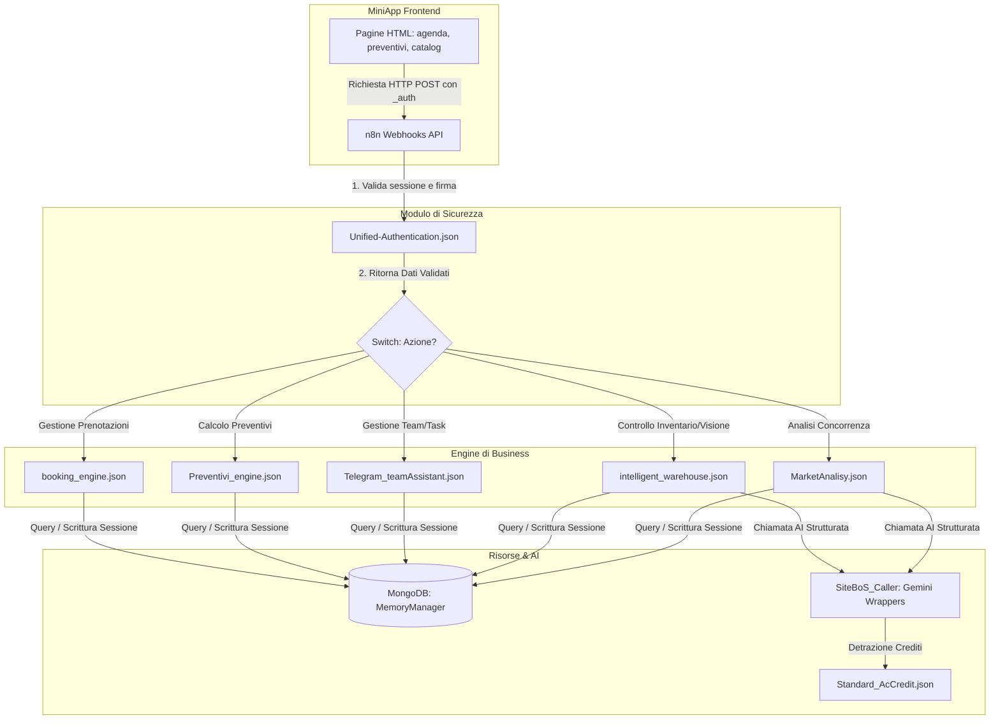

# Core Map: Stato del Progetto e Mappa delle Connessioni

Questo documento funge da **mappa funzionale ed operativa** per riprendere istantaneamente il lavoro sul progetto **SiteBoS**. Descrive come sono interconnessi i componenti del sistema (Frontend, Backend, Database, AI) e definisce il focus dello sviluppo corrente.

---

## 🗺️ 1. Mappa Architetturale delle Connessioni

Il flusso dei dati all'interno del sistema segue questo percorso logico:

---

## 📂 2. Mappatura dei File Chiave del Workspace

### 🖥️ Frontend (MiniApps & Stili)
*   **Directory**: `telegram_control/`
    *   `style.css`: Foglio di stile centrale per tutte le MiniApps (deve essere allineato per garantire un design premium ed omogeneo).
    *   `agenda.html`: Interfaccia prenotazioni.
    *   `preventivi.html`: Interfaccia per la compilazione dei preventivi.
    *   `catalog.html`: Visualizzazione e ricerca del catalogo prodotti.

### ⚙️ Backend (n8n Workflows in `n8n_workflows/`)
*   **Utility e Sicurezza (Root)**:
    *   `Unified-Authentication.json`: Subworkflow di sicurezza per chiamate da MiniApp.
    *   `Lock-Manager.json`: Controllo concorrenza modifiche dati.
    *   `Standard_AcCredit.json`: Gestore centrale dell'addebito crediti a consumo.
*   **Dashboard Hook (SiteBoS-App-Hook)**:
    *   `onboarding.json`: Gestione onboarding, recupero/salvataggio owner data con validazione dell'esistenza.
*   **AI Helper Wrappers (SiteBoS_Caller)**:
    *   `GeminiCall.json` / `GeminiGoogleMaps.json` / `GeminiGoogleSerch.json`: Proxy centralizzati per le API di Gemini.
*   **Engine Operativi (Servizi e MiniApp)**:
    *   `Telegram_customerBot/booking_engine.json` (Prenotazioni)
    *   `Telegram_customerBot/Preventivi_engine.json` (Calcolo e salvataggio preventivi)
    *   `operators/Telegram_teamAssistant.json` (Desk per operatori)
    *   `operators/supervisor.json` (Proxy catalog)
    *   `intelligence/intelligent_warehouse.json` (Scansione bolle/inventario)
    *   `intelligence/MarketAnalisy.json` (Analisi competitor locali)

## 📂 3. Come Utilizzare i Documenti Chiave di Sistema

Per navigare e modificare il workspace in modo corretto ed efficiente, questi sei documenti di sistema devono essere usati nel seguente modo:

1.  **[system_instructions.md](file:///c:/Users/garof/Desktop/TrinAi/SiteBoS-MiniApp/n8n_workflows/docs/System_Istruction/system_instructions.md) (Questo File)**:
    *   *Scopo*: Mappa funzionale, logica di connessione generale del workspace e focus di sviluppo corrente.
    *   *Quando usarlo*: Consultalo all'inizio di ogni sessione per comprendere come sono collegati i flussi (tramite il diagramma Mermaid) e sapere quali file e componenti sono attivi o sotto sviluppo attivo.
2.  **[Ready_to_production.md](file:///c:/Users/garof/Desktop/TrinAi/SiteBoS-MiniApp/n8n_workflows/docs/System_Istruction/Ready_to_production.md)**:
    *   *Scopo*: Registro dei workflow finiti, testati e considerati ufficialmente pronti o già attivi in produzione.
    *   *Quando usarlo*: Consultalo per sapere quali porzioni del backend sono definitive e "congelate". Quando completi e collaudi un workflow, aggiungilo qui.
3.  **[n8n_development_standards.md](file:///c:/Users/garof/Desktop/TrinAi/SiteBoS-MiniApp/n8n_workflows/docs/System_Istruction/n8n_development_standards.md)**:
    *   *Scopo*: Linee guida tecniche di programmazione, convenzioni grafiche e di sicurezza obbligatorie.
    *   *Quando usarlo*: Consultalo prima di modificare o creare qualsiasi nodo n8n (es. per copiare il codice Javascript standard del validatore Telegram o per applicare il pattern `alwaysOutputData` sui nodi MongoDB).
4.  **[backend_frontend_mapping.md](file:///c:/Users/garof/Desktop/TrinAi/SiteBoS-MiniApp/n8n_workflows/docs/System_Istruction/backend_frontend_mapping.md)**:
    *   *Scopo*: Mappa di integrazione degli endpoint tra l'interfaccia client (MiniApp) e le API di backend.
    *   *Quando usarlo*: Consultalo quando devi modificare le chiamate di rete `fetch` nelle pagine HTML/JS o quando devi tracciare quale endpoint chiama uno specifico workflow n8n.
5.  **[unfinished_backends.md](file:///c:/Users/garof/Desktop/TrinAi/SiteBoS-MiniApp/n8n_workflows/docs/System_Istruction/unfinished_backends.md)**:
    *   *Scopo*: Storico dei bug, dei blocchi e delle vecchie lacune architetturali risolte durante la pulizia dei backend legacy.
    *   *Quando usarlo*: Consultalo come benchmark storico per evitare di reintrodurre nodi orfani, logiche deprecate o bug di geocoding precedentemente risolti.
6.  **[SiteBos_todo.md](file:///c:/Users/garof/Desktop/TrinAi/SiteBoS-MiniApp/n8n_workflows/docs/System_Istruction/SiteBos_todo.md)**:
    *   *Scopo*: Elenco interattivo ed aggiornato dei compiti operativi aperti (To-Do) e completati (Done) del progetto.
    *   *Quando usarlo*: Collegalo al tuo Drive o visualizzalo per tracciare lo stato attuale dell'avanzamento dei lavori e depennare i singoli compiti completati.

---

## 🎯 4. Focus dello Sviluppo Corrente (Roadmap)

Le attività aperte e da riprendere nell'ordine sono tracciate nell'artifact [task.md](file:///C:/Users/garof/.gemini/antigravity-ide/brain/57b5553e-32ba-4dcb-bf97-450e1e9b353a/task.md):

1.  **Rifinitura Grafica Frontend**: Allineare gli stili in `telegram_control/style.css` per rendere le MiniApp esteticamente coerenti e con design premium.
2.  **Rifinitura Pagine HTML**: Completamento di `agenda.html` e `preventivi.html`.
3.  **Sicurezza Integrata su booking_engine.json**: Cablare la validazione tramite `Unified-Authentication.json` nel workflow delle prenotazioni.
4.  **Debugging Preventivi**: Risolvere il problema di connessione sul ramo `u_calc_prev_get` all'interno di `Preventivi_engine.json`.
